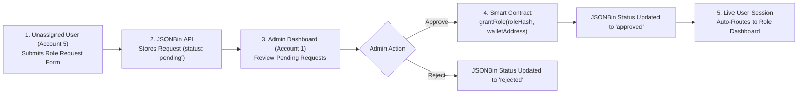
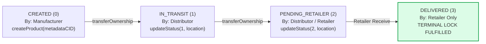

# ☕ TraceChain: Real-World Case Study, Architectural Endpoints & Flowchart Specifications

> **PDF Version Generated**: [`docs/TRACECHAIN_REAL_WORLD_FLOW_GUIDE.pdf`](file:///Users/pranil/Projects/TraceChain/docs/TRACECHAIN_REAL_WORLD_FLOW_GUIDE.pdf)  
> **Smart Contract (Polygon Amoy)**: `0x9cCd86A9117621c8B3D063A41ef8DEb3c43F9Bf9`  
> **GitHub Repository**: [pranil-shripad/TraceChain](https://github.com/pranil-shripad/TraceChain)

---

## 📖 1. The Real-World Story: Journey of Coffee Batch #402

This case study follows the real-world supply chain journey of **Specialty Organic Colombian Arabica Coffee Batch #402** from high-altitude farms in Colombia to a specialty roaster in Seattle, WA.

### 🎭 Persona Cast

| Persona | System Role & Wallet Address | Key Responsibilities |
| :--- | :--- | :--- |
| **Elena** | `DEFAULT_ADMIN_ROLE`<br/>`0x71C84074c77579122393F421C0074218C8384A1` | System Overseer; verifies producer credentials on-chain via `grantRole()`. |
| **Mateo** | `MANUFACTURER_ROLE`<br/>`0x90F79bf6EB2c4f870365E785982E1f101E93b906` | Coffee Estate Producer at El Paraíso, Colombia; registers harvest & pins metadata to IPFS. |
| **Carlos** | `DISTRIBUTOR_ROLE`<br/>`0x15d34AAf54267DB7D7c367839AAf71A00a2C6A65` | Freight Logistics Manager at Pacific Global Shipping; updates transit location & custody. |
| **Sophia** | `RETAILER_ROLE`<br/>`0x99655DA7063951315085d6880092c2a07530205b` | Store Manager at Emerald City Roasters, Seattle; receives shipment and triggers terminal lock. |
| **Liam** | **End Consumer**<br/>(Public Auditor) | Coffee enthusiast; scans printed QR code on retail bag to inspect immutable history. |

---

### ☕ The Narrative Flow

#### Act I: On-Chain Role Verification
Mateo operates El Paraíso Estate in Huila, Colombia (altitude 1,850m). To list his organic micro-lot coffee on the blockchain, Mateo connects his wallet and submits a role request. **Elena (Admin)** verifies Mateo's organic fair-trade certification documents and executes `grantRole(MANUFACTURER_ROLE, 0x90F7...)` on Polygon Amoy. Mateo's wallet address is now authorized on-chain.

#### Act II: Genesis on Polygon & Decentralized IPFS Pinning
Mateo harvests 500 kg of specialty beans (Cup Score 88.5). In the TraceChain DApp, Mateo uploads the moisture lab analysis report and bean batch photos.
1. The DApp pins the bean image to IPFS via Pinata (`QmX7b8Yz...`).
2. The DApp pins the metadata JSON containing altitude, farm coordinates, cup score, and image CID to IPFS (`QmMeta402...`).
3. Mateo signs `createProduct("ipfs://QmMeta402...")`. Smart Contract **Product ID #402** is generated with status **`CREATED (0)`**.

#### Act III: International Freight & Custody Transfer
Carlos (Logistics Operator holding `DISTRIBUTOR_ROLE`) prepares Container #C-902 at Port of Buenaventura. 
1. Mateo signs `transferOwnership(402, 0x15d3...)`, handing legal custody to Carlos.
2. Carlos updates the status to **`IN_TRANSIT (1)`** with location string `"Port of Buenaventura -> Pacific Maritime Route"`.

#### Act IV: Arrival in Seattle & Terminal Status Lock
Container #C-902 arrives at Seattle Port Terminal 18. Carlos transfers custody to **Sophia (Retailer holding `RETAILER_ROLE`)** and sets status to **`PENDING_RETAILER (2)`** with location `"Seattle Port Terminal 18"`. 
Upon physical delivery at Emerald City Roasters, Sophia signs `updateStatus(402, DELIVERED, "Emerald City Roasters, Seattle WA")`. The smart contract enforces a **terminal lock** — Product #402 is marked **`DELIVERED (3)`** and permanently frozen against any future status modifications.

#### Act V: Consumer QR Code Audit
Liam buys a bag of coffee at Emerald City Roasters. Scanning the QR code takes him to `/products/402`. The DApp queries Polygon Amoy testnet directly, displaying every verified step, timestamp, custodian address, and IPFS moisture report with zero central database reliance.

---

## 📊 2. System Architecture Flowcharts

### Flowchart 1: Role Request & On-Chain Governance Flow



### Flowchart 2: Monotonic Product Lifecycle & Custody Flow



---

## 🛠️ 3. Complete Technical Endpoints & API Specs

### Smart Contract Methods (`SupplyChain.sol`)

| Method Signature | Contract | Input Parameters | Access Control |
| :--- | :--- | :--- | :--- |
| `createProduct(string calldata _metadataCID)` | `SupplyChain.sol` | `_metadataCID`: IPFS CID string | `MANUFACTURER_ROLE` |
| `updateStatus(uint256 _id, State _status, string calldata _location)` | `SupplyChain.sol` | `_id`: uint256, `_status`: uint8 (0-4), `_location`: string | `DISTRIBUTOR` or `RETAILER` |
| `transferOwnership(uint256 _id, address _newOwner)` | `SupplyChain.sol` | `_id`: uint256, `_newOwner`: address | **Current Custodian Only** |
| `grantRole(bytes32 role, address account)` | `SupplyChain.sol` | `role`: keccak256 hash, `account`: address | `DEFAULT_ADMIN_ROLE` |
| `hasRole(bytes32 role, address account)` | `SupplyChain.sol` | `role`: keccak256 hash, `account`: address | Public View (Free) |

### REST & IPFS Service Endpoints

```http
POST https://api.pinata.cloud/pinning/pinJSONToIPFS
Authorization: Bearer <PINATA_JWT>
Content-Type: application/json

GET https://api.jsonbin.io/v3/b/<BIN_ID>/latest
X-Master-Key: <JSONBIN_MASTER_KEY>

PUT https://api.jsonbin.io/v3/b/<BIN_ID>
X-Master-Key: <JSONBIN_MASTER_KEY>
Content-Type: application/json
```

---

## 🧪 4. Multi-User Test Account Matrix

| Account # | Persona & Address | Role Assigned | Test Action |
| :--- | :--- | :--- | :--- |
| **Account 1** | Elena (`0x71C84074c77579122393F421C0074218C8384A1`) | `DEFAULT_ADMIN_ROLE` | Grant roles, approve requests, audit all products |
| **Account 2** | Mateo (`0x90F79bf6EB2c4f870365E785982E1f101E93b906`) | `MANUFACTURER_ROLE` | Pin IPFS metadata & call `createProduct()` |
| **Account 3** | Carlos (`0x15d34AAf54267DB7D7c367839AAf71A00a2C6A65`) | `DISTRIBUTOR_ROLE` | Update status to `IN_TRANSIT (1)` & `PENDING_RETAILER (2)` |
| **Account 4** | Sophia (`0x99655DA7063951315085d6880092c2a07530205b`) | `RETAILER_ROLE` | Update status to `DELIVERED (3)` (Terminal Lock) |
| **Account 5** | Unassigned (`0x3C44CdD45919C505F6608Ac18382E0099C2354E`) | `none` | Submit role request form & view public product explorer |
